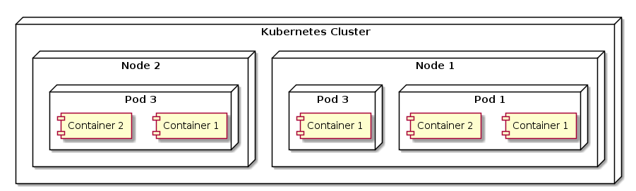

# K8s Pods

## Pengertian Pods



- Pods adalah unit terkecil dari sebuah kubernetes cluster yang berada di dalam nodes
- di dalam nodes bisa berisi banyak pods
- pods berisi satu atau lebih container

## Mengapa dalam nodes tidak berisi langsung container ?

1. Abstraksi dan Manajemen yang Lebih Baik:
   - Pods memberikan lapisan abstraksi tambahan di atas container, yang memungkinkan Kubernetes untuk mengelola aplikasi dengan lebih efisien dan fleksibel. Pods menyediakan lingkungan yang stabil untuk container, dengan memberikan identitas jaringan yang unik dan kemampuan untuk berbagi sumber daya antara container dalam satu Pod.
   - Abstraksi ini memungkinkan Kubernetes untuk bekerja dengan berbagai jenis container runtimes, memberikan fleksibilitas dalam memilih teknologi container yang berbeda.
2. Kolokasi dan Skalabilitas:
   - Dengan mengelompokkan container dalam satu Pod, Kubernetes memastikan bahwa container-container tersebut selalu berjalan bersama di node yang sama. Ini memungkinkan komunikasi dan koordinasi yang lebih cepat dan efisien.
   - Ini sangat berguna untuk aplikasi yang terdiri dari beberapa proses yang saling bergantung dan perlu berinteraksi secara dekat. Sebagai contoh, server web yang selalu membutuhkan caching proxy dapat ditempatkan dalam satu Pod.
3. Lifecycle Management:
   - Pods memudahkan pengelolaan siklus hidup container. Kubernetes dapat mengatur dan menjadwalkan container dalam satu Pod untuk memulai, menghentikan, atau me-restart secara bersamaan atau berdasarkan kebijakan tertentu.
   - Pods mendukung deklarasi konfigurasi dan otomatisasi dari pengelolaan container seperti scaling, rolling updates, dan self-healing.

## Basic Perintah Pods dalam kubectl

### Melihat list pods

```bash
kubectl get po
```

### Melihat detail pods

```bash
kubectl describe po pod_name
```

## Label dalam pods

Labels adalah pasangan key-value yang dapat diterapkan pada objek Kubernetes, seperti Pods, untuk mengatur dan mengelompokkan sumber daya. Penggunaan labels sangat terbatas dan tidak boleh ada space hanya pakai '-'.

Manfaat Label

1. Identifikasi dan Klasifikasi:
    Labels digunakan untuk mengidentifikasi dan mengklasifikasikan Pods berdasarkan atribut tertentu, seperti aplikasi yang mereka jalankan, lingkungan (dev, test, prod), atau versi tertentu.

2. Pencarian dan Seleksi:
    Dengan menggunakan selectors, label memungkinkan Kubernetes untuk memilih sekelompok Pods yang memenuhi kriteria tertentu. Ini sangat berguna dalam mengelola deployment, scaling, dan operasi lainnya pada kelompok Pods tertentu.
3. DLL
   Sebenarnya ada banyak fungsi label belum disebutkan. Kedepan nya kita sangat membutuhkan label dalam beberapa hal. Oleh karena itu label dalam pods sangat berguna sekali.

## Contoh Perintah Label

### Menambah label manual tanpa file YAML atau JSON (NO RECOMENDED)

```bash
kubectl label po name_pods key=value
kubectl label po name_pods key=value --overwrite
```

- Menambah label manual tanpa file config YAML atau JSON sangat tidak recomended karena label yang kita tambahkan tidak terdeteksi di file config. Karena kedepan nya sangat dibutuh sekali dalam banyak hal(selector,probe,rc,rs,dll). Maka dari hati - hati penggunaan nya
- flags --overwrite jika key ada value nya akan timpa. tetap saja penambahan label manual tidak recomended

### Mencari Pods menggunakan labels

```bash
kubectl get po -l key
kubectl get po -l key=value
kubectl get po -l key!=value
kubectl get po -l ‘!key’
kubectl get po -l ‘key in (value1,value2)’
kubectl get po -l ‘key notin (value1,value2)’
```

### Mencari Pods menggunakan lebih dari satu labels

```bash
kubectl get po key,key2=value
kubectl get po key=value,key2=value
```

## Annotation dalam Pods

- Fungsi dari annotation mirip labels akan tetapi annotation penggunaan nya bebas. Annotation lebih condong digunakan untuk informasi detail tentang pods atau pun deskripsi pods.
- Setiap annotation bisa menampung informasi sekitar 256kb
- Annotation tidak digunakan untuk selector seperti labels

### Menambah Annotation manual tanpa file YAML atau JSON (NO RECOMENDED)

```bash
kubectl annotate po name_pods key=value
kubectl annotate po name_pods key=value --overwrite
```

- Seperti yang saya sampaikan pada label menambakan annontation manual tanpa file tidak rekomendasi meskipun annotation tidak seberguna labels tetap tidak recomended karena agar menjaga konsistensi file config YAML atau JSON.

## Menambahkan Label dan Annotation dalam Pods Memakai File Config

```yaml
apiVersion: v1
kind: Pod
metadata:
  name: example-pods # cannot with space
  labels:
    environment: dev
    version: "1.0"
  annotations:
    description: "example pods for learn k8s pods with label and annotations"

spec:
  containers:
  - name: nginx
    image: nginx:stable-alpine3.19-perl
    ports:
      - containerPort: 80

```

## Menghapus Pods 

```bash
kubectl po namepod
#or
kubectl po namepod1 namepod2 namepod3
```

### Menggunakan Labels

```bash
kubectl po -l key=value
```

### Menghapus Semua Pods di Namespace

```bash
kubectl delete po --all --namespace namanamespace
```